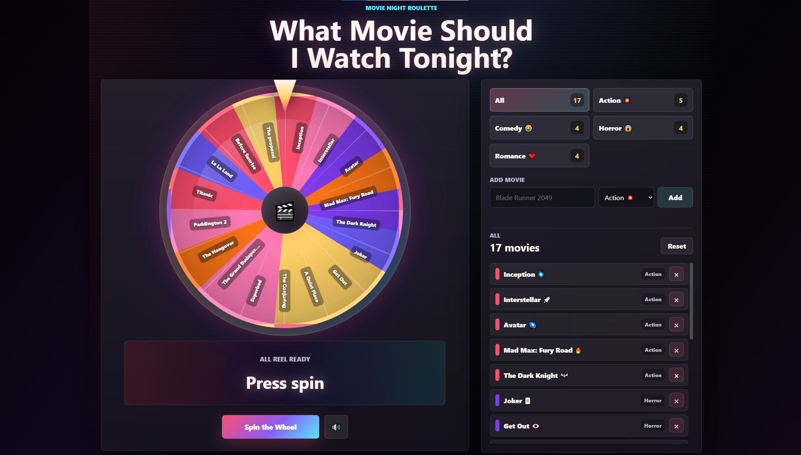

# 🎬 Movie Spinner App

A fun and interactive web app that helps you decide **what movie to watch tonight** using a spinning roulette 🎡

---

## ✨ Features

- 🎡 Animated movie spinner (roulette)
- 🎬 Random movie selection
- 🗂️ Categories (Action, Comedy, Horror, Romance)
- ➕ Add your own movies
- ❌ Remove movies from the list
- 🎉 Confetti effect when a movie is selected
- 🌙 Modern dark UI (cinematic style)

---

## 🛠️ Tech Stack

- ⚛️ Next.js (React)
- 🎨 CSS (custom styling)
- 💡 JavaScript / TypeScript

---

<!-- ## 🚀 Live Demo

👉 (add your Vercel link here after deploy)

--- -->

## 📸 Preview

A cinematic-style spinner that randomly selects a movie for you 🎥  
No more “I don’t know what to watch” 😄


---

## 🧠 How It Works

The app uses a roulette-style spinner that randomly selects a movie from a dynamic list.  
Users can manage their own movie list and categories, making the experience interactive and customizable.

---

## 📦 Installation

If you want to run it locally:

```bash
npm install
npm run dev